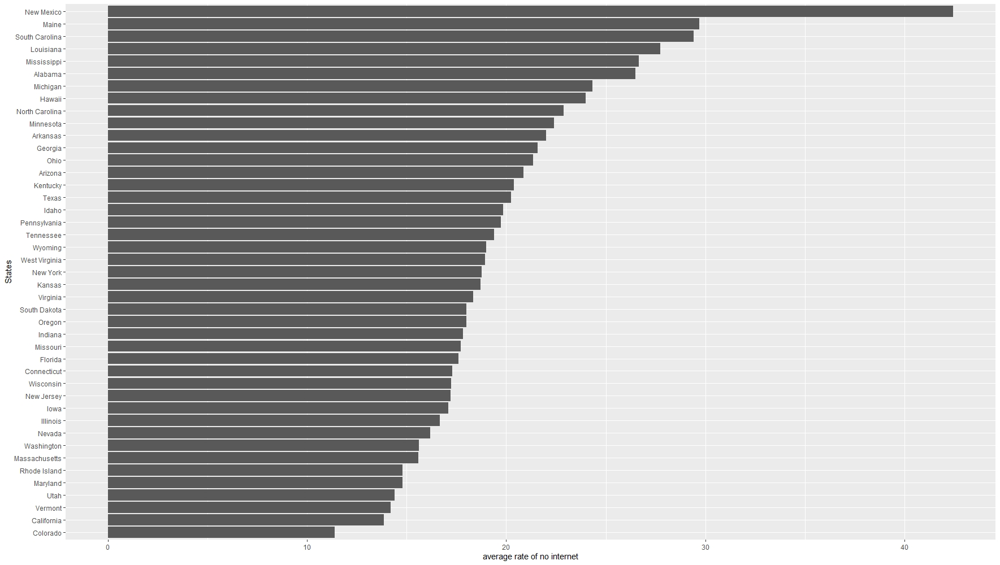

```{r setup, include=FALSE}
knitr::opts_chunk$set(echo = TRUE)
```

## Introduction

This project sought to predict the percentage of populations with no access to internet at county levels. The original data source itself already have some demographic information, and it was supplemented with additional data from Census Bureau. The outcome variable was `no_internet` and around 16 predictors were used in the model. Ultimately, although the final model was able to obtain lower RMSE value, its percentage error is too high to conclude that the model is accurate at predicting `no_internet`.

## Exploratory Data Analysis




In the exploratory data analysis, it is found that `no_internet` does vary state by state, meaning that states could be a good predictor/dummy variable to be used in the model. The correlation plot above yielded some possible predictors that can be used in the model, depending on their correlation with the outcome variable itself. The correlation plot was also used to find potential predictors for `minority_percentage` , which had some missing values that needed to be imputed.

## Modeling

The initial model used Boosted Trees, Random Forests, and K-Nearest Neighbors model. The tuning of those models and cross-validations shows that the random forest with minimum node of 2 and 15 random predictors have the lowest Root Mean Square Error (RMSE) and thus most accurate.

After the optimal model was determined, it was then tested on the testing set. The result yielded RMSE of 3.05 and Mean Average Percent Error (MAPE) of 12.3 . Although the RF model was more accurate than its predecessors, 12.3% of MAPE indicates that there are still some improvements to be made. Ways to improve this possibly includes: selective choosing of predictors, adding interactions between predictors, and finding other correlated predictors data (maybe from Census Bureau).

## Conclusion

In some aspect, the model has performed better than expected, as it had lower RMSE than on training set. But MAPE is high, so there will be plenty of rooms for improvement. However, this project might still have its applications, as the data on internet availability nationwide is unclear and a good reliable model could help fill in the gap and identify communities in need.

## 
