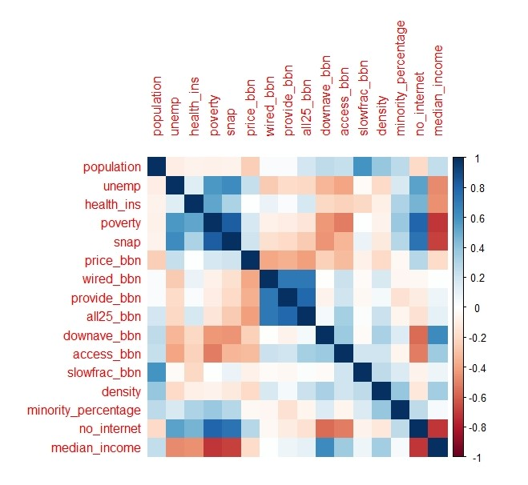

```{r setup, include=FALSE}
knitr::opts_chunk$set(echo = TRUE)
```

```{r}
library(tidyverse)
knn_tuned <- read_rds("knn_tuned.rds")
rf_tuned <- read_rds("rf_tuned.rds")
bt_tuned <- read_rds("bt_tuned.rds")
```

## Introduction

The primary source of the data was obtained from a user in Kaggle called `MMattson`. The data is a combined data from two sources: Institute of Museum and Library Services and BroadbandNow.Com. He (assuming is a male) also combined data from Census Bureau and Bureau of Labor Statistics. I further altered the dataset by combining from other Census Bureau datasets; the metric of interest was median income and percentage of minorities. The observation row is by counties/parishes/census areas, and the main data was joined by Census FIP code.

The motivation of my research is the same as the author of the dataset. Our motivation primarily stemmed from the current pandemic when the importance of broadband availability was elevated from important to essential. With so much businesses and educations conducted online, broadband availability and internet access is very important, to say the least. As a sign of its importance, recent bipartisan infrastructure bill passed by Congress set aside \$65 billion for broadband construction in the rural area. One key flaw in the effort to connect Americans to the internet is the lack of accurate data. BroadbandNow.Com [noted](https://broadbandnow.com/research/fcc-underestimates-unserved-by-50-percent) that FCC's data on internet connectivity relies on self-reporting by ISPs. Rural area is more harder hit than urban area. The potential application of this research is that it could better help policymakers prioritize areas with low connectivity.

## Exploratory Data Analysis

My target variable for this project is `no_internet` , which describes the percentage of population within each county that does not have access to internet. This is different from another variable, `access_bbn`, which describes broadband availability. Even though residents may have access to broadband, they might not be able to afford the service, hence `no_internet` is believed to be the best outcome variable. My first EDA involved the only dummy variable, which is the state.


As can be seen above, each state have varying level of internet connectivity, with New Mexico being the worst state and Colorado being the best state for internet connection availability. Having `state` as a dummy variable is a good idea because states' policy on broadband could have impact on internet connectivity, as well as their defining geographical feature.

In order to see what I predictors I should use, I also created a correlation plot to examine all numerical predictors' correlations with each other. The result of the correlation plot yielded some surprising result which I did not. I thought there would be a stronger correlation between `no_internet` and `price_bbn`, as the affordability could have been a strong factor. Although there is a positive correlation, it is a weak one. There were also predictors which I anticipated having correlation with the outcome variable; for example, `poverty` and `SNAP` (rate of population on food stamps) have a strong correlation with `no_internet` . This makes intuitive sense, as affordability could be a major cause, though it is partially contradicted by weak correlation of `price_bbn` . `downave_bbn` (download speed) and `access_bbn` has a negative correlation with `no_internet` , which are reasonable expectation. There is also a correlation between `median_income` and `no_internet`, which again relates to my theory that affordability could be a major barrier for internet accessbility. I was very surprised by no correlation between `density` (population density) and `no_internet`; my initial expectation was that difficulty of constructing fiber optics cable would limit the internet availability in rural, less dense area, but there are no statistical relationships between the two.



During my initial review of the data, I have noticed that `minority_percentage` lacks around 1% of data which will need to be imputed through other correlation. To find predictors which correlate with `minority_percentage`, I looked through correlation plots. There are no significant correlations with other predictors; however, I thought that `unemp` and `snap` and `median income` might have correlations, given my limited background knowledge in socio-economic. So I plotted three line charts to examine the relationships.


The line and point graph is consistent with the correlation plot, with a weak positive correlation. Median Income seems to be a weak variable to predict minority, with initial positive correlation then a steep plunge. I will be still imputing those three variables because they still have a positive correlation in the beginning, but no fingers crossed.

## Fitting Models

Three types of model was use for this project: random forest, boosted trees, and K-Nearest Neighbors. Cross-validation was used to ensure optimal hyperparameters for the models. Root Mean Square Error (RMSE) was used as the metric for accuracy


In the random forest model, we see that minimum node size of 2 and 15 randomly selected predictors minimizes the RMSE to 3.39.


In the boosted tree, we see that learning rate of 0.63, minimum node size of 40, and 66 randomly selected predictors yields the lowest RMSE at 3.67.

{width="340"}

As for the KNN model, the best performing model were with 8 neighbors, which yielded the lowest RMSE of 4.46 .

Based on the evaluation of three types of model, it seems that random forest with its optimal hyperparameter performed the best, while KNN model with its optimal hyperparameter performed the worst. Random Forest will be used next on the testing set.

## Performance Set

The random forest model with optimal hyper-parameter was fitted onto the testing set. The average RMSE was 3.05. Out of curiosity, Mean Average Percent Error (MAPE) was also measured, which yielded 12.3% error. The performance of the model was better than the performance in cross validation, evidenced by the lower RMSE. It was also lower than the RMSE and MAPE of the null model (6.73 and 30.9 respectively). However, considering MAPE, the performance is still not satisfactory.


## Next Step

The modeling result was a failure, as evidenced by MAPE, though it did still have bright spots. The random forest model performed better on the testing set than it did in cross-validation, meaning that overfitting was unlikely. Although RMSE was lower, MAPE was still too high for the model to be useful. This indicates that the root of the problems lies in recipe and predictors used to estimate `no_internet`.

For the next model fittings, it would be best to follow the saying, "Garbage in, garbage out". Predictors should be narrowed to the ones which correlated with the outcome variable. Furthermore, additional statistical traits of counties should be examined for correlation, with hopes that more predictors would yield better RMSE and MAPE. Recipe should be modified; the most egregious step missing was `step_interaction`. It was not included as I wasn't sure how to tell variables interacted with each other, but it could definitely be an improvement step.
